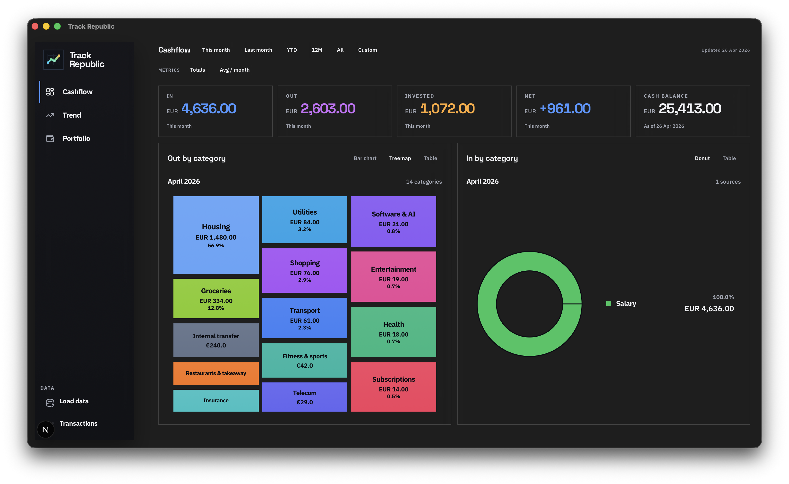
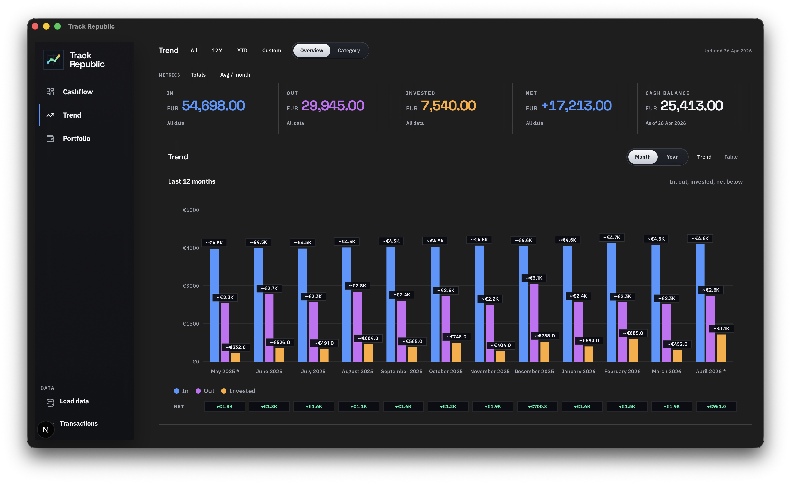
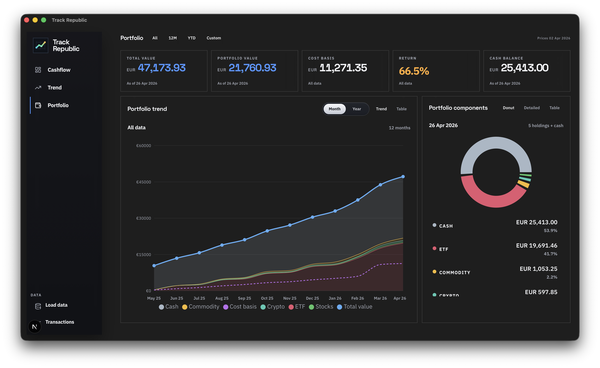

# Track Republic

Track Republic is a local-first cashflow and portfolio analytics app for Trade Republic exports. It turns statement PDFs into structured transaction data, classifies rows with rules plus local LLM prompts, and gives you a desktop-quality dashboard for cashflow, trend, transaction cleanup, and portfolio performance.

<p align="center">
  
</p>

## Overview

- Local-first: data, rules, prompts, and overrides stay in your workspace
- Built for Trade Republic statements, cash accounts, and portfolio activity
- Rules plus LLM classification with editable transaction and investment overrides
- Runs as both a Next.js app and a native Tauri desktop shell

## Screens

<table>
  <tr>
    <td width="50%">
      
    </td>
    <td width="50%">
      
    </td>
  </tr>
  <tr>
    <td valign="top">
      <strong>Trend</strong><br />
      Compare inflows, outflows, invested amounts, and net balance across month, year, or custom ranges.
    </td>
    <td valign="top">
      <strong>Portfolio</strong><br />
      Track total value, cost basis, return, asset mix, and portfolio trend, with manual subtype corrections when classifications miss.
    </td>
  </tr>
</table>

## What It Does

- Parse Trade Republic PDF statements into normalized CSV files
- Classify transactions with manual rules, deterministic heuristics, and local Ollama prompts
- Review and override categories, linked transactions, and investment subcategories in the UI
- Analyze cashflow, recurring expenses, trend, and portfolio returns
- Keep the full workflow local, without depending on a hosted backend

## Main Areas

- `Cashflow`: monthly metrics, inflow vs outflow breakdowns, category treemaps, and summaries
- `Trend`: monthly and yearly views for income, spending, invested capital, and net result
- `Portfolio`: holdings, cash, cost basis, return, allocation, and performance trend
- `Transactions`: searchable ledger with manual edits, row overrides, links, and cleanup actions
- `Load data`: import statements, rerun the pipeline, and tune classifier behavior

## Getting Started

### Requirements

- macOS for PDF parsing through `PDFKit` + `swift`
- Node.js
- Optional: Ollama for local transaction classification

### Install

```bash
npm install
```

### Run the web app

```bash
npm run dev
```

Open [http://localhost:3000](http://localhost:3000).

### Run the desktop app

```bash
npm run desktop
```

### Import a statement from the command line

```bash
./scripts/convert_trade_republic_statement.py /path/to/statement.pdf --output-dir data/processed
```

### Classify transactions with a local model

```bash
./scripts/categorize_transactions.py data/processed/statement_transactions.csv --model qwen3.5:9b
```

On a fresh clone, the app starts empty until you import your own statement data.

## Data and Config

- `src/`: Next.js UI and local app routes
- `src-tauri/`: desktop shell
- `scripts/`: PDF conversion and classification pipeline
- `data/raw/`: imported source files
- `data/processed/`: generated CSV outputs and caches
- `config/`: registry, prompt templates, manual rules, and row overrides

## Classification Approach

Transaction classification uses three layers:

1. manual rules from `config/manual_category_rules.csv`
2. deterministic handling for obvious rows such as trades, taxes, interest, cashback, and self-transfers
3. local LLM classification for rows that still need interpretation

Prompt templates live in:

- `config/classifier_prompt_template.txt`
- `config/investment_asset_class_prompt_template.txt`

This keeps recurring runs fast while still allowing manual control over edge cases.

## Useful Commands

```bash
npm run dev
npm run desktop
npm run desktop:check
npm run build
npm run build:desktop
```
